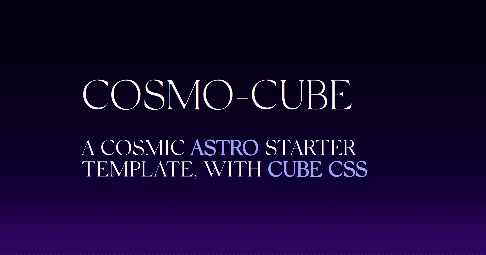

# 🧊 [cosmo-cube](https://cosmo-cube.vercel.app)

[](hello)

An opinionated [Astro](https://astro.build/) starter kit for your next blog, documentation, personal/marketing website, and more.

it comes with the [CUBE CSS](https://cube.fyi/) file structure, a methodology for managing stylesheets efficiently no matter the size of the project.

most styles are for demo purposes and to explain the underlying philosophy: "Be the browser's mentor, not its micromanager" (see [buildexcellentwebsit.es](https://buildexcellentwebsit.es)).

## Features

- **[CUBE CSS](https://cube.fyi/) implementation**: take a look at the docs, they are concise and explain way better than i would
- **fluid and responsive**: it looks great no matter the device size
  - [Every Layout](https://every-layout.dev/) examples for layout elements
  - [Utopia](https://utopia.fyi/) for fluid `clamp()`-based font sizes and spacing
- **lightweight**: 💯 [lighthouse score](https://pagespeed.web.dev/analysis/https-cosmo-cube-vercel-app/hyl36ga17o) across the board — not surprising considering the size of the project, but worth mentioning
- **dark-mode ready**: implement your own theme switcher if you're into that sort of thing, all you have to do is toggle the `data-theme` attribute on the body
- **SEO** ready: basic SEO meta-tags are set-up, with `sitemap`s automatically generated at build time

## 🚀 Getting Started

[](https://app.netlify.com/start/deploy?repository=https://github.com/advanced-astro/cosmo-cube)
[](https://vercel.com/new/clone?repository-url=https://github.com/advanced-astro/cosmo-cube&project-name=cosmo-cube&repository-name=cosmo-cube&demo-title=Cosmo-Cube%20-%20Astro%20Starter%20Template&demo-description=Astroship%20is%20a%20starter%20template%20for%20startups%2C%20marketing%20websites%20%26%20landing%20pages.%20Built%20with%20Astro%2C%20Cube%20CSS&demo-url=https%3A%2F%2Fcosmo-cube.vercel.app&demo-image=https%3A%2F%2Fgithub.com/advanced-astro/cosmo-cube/blob/main/src/assets/images/og-image.png)

## installation

### clone this repo

```sh
git clone https://github.com/advanced-astro/cosmo-cube.git
```

### instal dependencies

```sh
cd cosmo-cube
pnpm i
```

### spin up local dev server

```sh
pnpm dev
```

### build to `./dist/`

```sh
pnpm build
```

### preview production build

```sh
pnpm preview
```

### ...or use the template directly ➡️ "Use this template" > "Create a new repository"

## contributions are welcome! 👋

it's great if this kit can be helpful to some folks out there, i'm open to feedback and greatly appreciate contributions, feel free to chip in for fixes, suggestions, or features! let me know if you have improvement ideas.

---

## credits

greater minds than mine are behind the choices in this kit, i'd like to mention them for the inspiration and learning provided:

### **[Astro core & docs team](https://docs.astro.build/en/getting-started/)**

along with contributors, for a great onboarding experience and a wholesome community.

- [Astro Integrations]([https://](https://astro.build/integrations/))
  - [astro-compress](https://github.com/astro-community/astro-compress#readme)
  - [astro-compressor](https://github.com/sondr3/astro-compressor#readme)
  - [@astrojs/sitemap](https://docs.astro.build/en/guides/integrations-guide/sitemap/)

### **[Andy Bell](https://andy-bell.co.uk/)**

Andy is a great source of inspiration for building robust UI working with the browser, rather than against it. but also for reminding me that CSS is an extremely powerful tool as it is. CUBE CSS really clicked to me as it brought pure "traditional" CSS to the component-first world of today.

- [Every Layout](https://every-layout.dev/)
- [CUBE CSS](https://cube.fyi/)

### **[Heydon Pickering](https://heydonworks.com/)**

Heydon provides amazing insights and spicy takes on how to build for the web, from an inclusive and accessible perspective.

- [Inclusive Components](https://inclusive-components.design/)
- [Webbed Briefs](https://briefs.video/)
- [Every Layout](https://every-layout.dev/)

### **[Lene Saile](https://www.lenesaile.com/en/)**

Lene made an amazing [Eleventy](https://www.11ty.dev/) starter based on CUBE CSS which is way more mature and complete than this one. it comes batteries included to build a full-blown blog with 11y in a breeze, i'd definitely recommend checking it out.

her starter greatly inspired me to build one for Astro (it will be a separate one from this minimal one).

- [Eleventy Excellent](https://github.com/madrilene/eleventy-excellent)

### **[William Hermozo](https://williamhzo.me/)**

William made [Astro-Cube](https://astro-cube.vercel.app/) a tiny, almost-unopinionated Astro starter for your next blog, documentation, personal/marketing website, and more.

his work formed the foundation for me to fork and create this opinionated and supercharged Astro starter kit.
